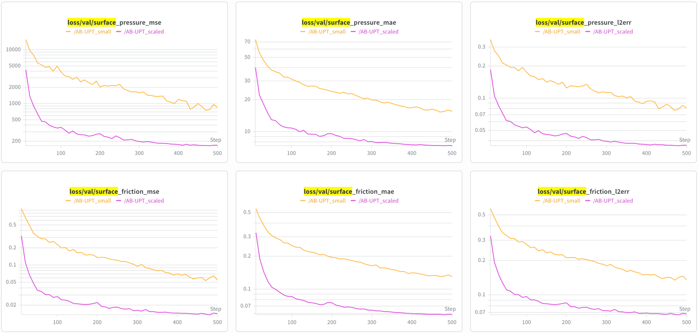
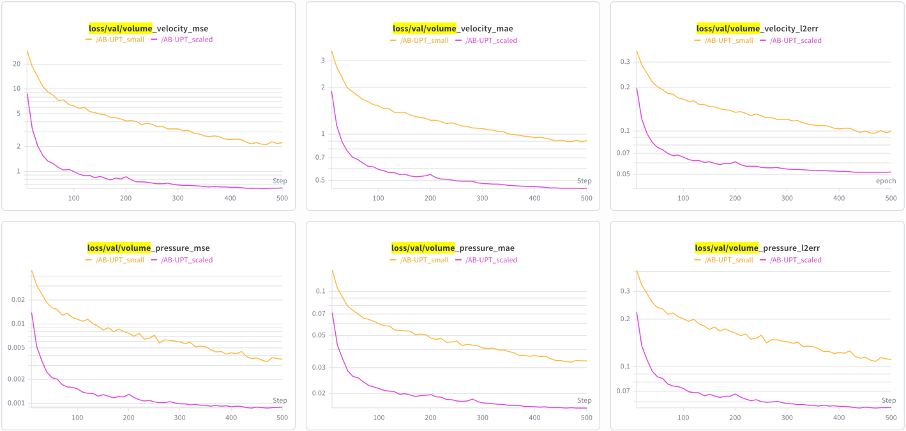

# AB-UPT Showcase

Train, evaluate, and visualize the Anchored-Branched Universal Physics Transformer (AB-UPT) on the DrivAerML automotive aerodynamics dataset.

## Overview

[AB-UPT](https://arxiv.org/abs/2502.09587) is a geometry-aware neural surrogate for computational fluid dynamics (CFD).
Given a 3D car geometry, it predicts surface pressure, volume fields (velocity, pressure, vorticity), etc. It's aimed 
to replace expensive CFD simulations that take hours with inference that takes seconds.

The [DrivAerML](https://arxiv.org/abs/2408.11969) dataset contains ~500 parametric car geometries with high-fidelity 
CFD results. Each sample includes the surface mesh, volume mesh, and corresponding physical fields. This showcase uses 
a 10x subsampled version for faster iteration. 

**Architecture at a glance:**

1. **Geometry encoder** -- encodes the input point cloud into a latent representation via supernode pooling
2. **Physics blocks** -- iterates between self-attention on supernodes and cross-attention with domain anchor points (`perceiver -> self -> cross -> self -> cross -> self`)
3. **Domain decoders** -- separate decoder heads for surface and volume domains, each predicting domain-specific fields

The model predicts at *anchor points* (fixed positions sampled during training) and optionally at additional 
*query points* (arbitrary positions provided at inference time) for higher-resolution output.

## Dataset

> [!NOTE]
> Emmi AI does not own the DrivAerML data. We redistribute a subsampled copy for convenience only, to avoid requiring 
> users to download the full multi-terabyte dataset. The data is provided as-is with no warranty. Please refer to the
> [original DrivAerML repository](https://caemldatasets.org/) for licensing and terms of use.

The DrivAerML dataset (subsampled 10x) is hosted on HuggingFace:
[EmmiAI/DrivAerML_subsampled_10x](https://huggingface.co/datasets/EmmiAI/DrivAerML_subsampled_10x)

### Download with `noether-data` CLI

```bash
# Full dataset snapshot
noether-data huggingface snapshot EmmiAI/DrivAerML_subsampled_10x /path/to/drivaerml
```

See `noether.io.cli` for additional options (verification, manifests, parallel downloads).

### Download with huggingface_hub

```bash
uv pip install huggingface_hub

huggingface-cli download EmmiAI/DrivAerML_subsampled_10x \
  --repo-type dataset \
  --local-dir /path/to/drivaerml
```

### Download with Python

```python
from huggingface_hub import snapshot_download

snapshot_download(
    repo_id="EmmiAI/DrivAerML_subsampled_10x",
    repo_type="dataset",
    local_dir="/path/to/drivaerml",
)
```

## Prerequisites

The `--export-vtk` flag requires `pyvista`, which is included in the core Noether dependencies. No extra packages are needed beyond a standard Noether installation.

## Quick Start

All commands must be run from the `recipes/aero_cfd/` directory with `recipes/` on the Python path:

```bash
cd recipes/aero_cfd/
export PYTHONPATH=$(git -C ../.. rev-parse --show-toplevel)/recipes:$PYTHONPATH
```

### Train

```bash
# Small model -- fast iteration / smoke tests
python -m showcase.cli train \
  --dataset-root /path/to/drivaerml \
  --output-path /path/to/outputs

# Scaled model on GPU (hidden_dim=384, 6 heads, 6 decoder blocks/domain)
python -m showcase.cli train \
  --dataset-root /path/to/drivaerml \
  --output-path /path/to/outputs \
  --model-size scaled \
  --accelerator gpu \
  --precision float16

# Scaled model on Apple Silicon (reduced point budget)
python -m showcase.cli train \
  --dataset-root /path/to/drivaerml \
  --output-path /path/to/outputs \
  --model-size scaled_mps \
  --accelerator mps

# With experiment tracking
python -m showcase.cli train \
  --dataset-root /path/to/drivaerml \
  --output-path /path/to/outputs \
  --tracker wandb \
  --tracker-project my-aero-project
```

### Resume Training

Training automatically saves optimizer state for resumability.  To continue a
previous run:

```bash
python -m showcase.cli train \
  --dataset-root /path/to/drivaerml \
  --output-path /path/to/outputs \
  --model-size scaled \
  --accelerator gpu \
  --precision float16 \
  --max-epochs 1000 \
  --resume-run-id 2026-04-09_abc12

# Resume from a specific checkpoint (default: latest)
  --resume-checkpoint E100
```

### Evaluate

```bash
# Anchor-resolution metrics + save predictions
python -m showcase.cli evaluate \
  --dataset-root /path/to/drivaerml \
  --output-path /path/to/outputs \
  --run-id 2026-04-09_abc12

# Dense query inference (higher-resolution predictions)
python -m showcase.cli evaluate \
  --dataset-root /path/to/drivaerml \
  --output-path /path/to/outputs \
  --run-id 2026-04-09_abc12 \
  --query-inference \
  --num-inference-surface-points 20000

# With VTK export and force coefficients
python -m showcase.cli evaluate \
  --dataset-root /path/to/drivaerml \
  --output-path /path/to/outputs \
  --run-id 2026-04-09_abc12 \
  --query-inference \
  --export-vtk \
  --compute-forces

# Select a specific checkpoint
python -m showcase.cli evaluate \
  --dataset-root /path/to/drivaerml \
  --output-path /path/to/outputs \
  --run-id 2026-04-09_abc12 \
  --checkpoint best_model.loss.test.total
```

### Export to VTK (standalone)

```bash
python -m showcase.cli export-vtk \
  --predictions-path /path/to/outputs/2026-04-09_abc12/eval/predictions/sample_0000.pt \
  --output-path result.vtp \
  --domain surface
```

Open the `.vtp` files in [ParaView](https://www.paraview.org/) and color by field (e.g., `surface_pressure`,
`surface_friction`).

## Model Sizes

| Size | Hidden Dim | Heads | Decoder Blocks | Geometry Points | Supernodes | Surface Anchors | Volume Anchors |
|------|-----------|-------|----------------|-----------------|------------|-----------------|----------------|
| `small` | 192 | 3 | 2 | 16,384 | 1,024 | 512 | 512 |
| `scaled` | 384 | 6 | 6 | 125,000 | 32,000 | 16,000 | 32,000 |
| `scaled_mps` | 384 | 6 | 6 | 16,384 | 4,096 | 2,048 | 4,096 |

All sizes use the same physics block pattern: `perceiver -> self -> cross -> self -> cross -> self`.

- **`small`** -- Fast iteration and smoke tests. Default for CPU.
- **`scaled`** -- Full research configuration for GPU. Use `--precision float16` for ~2x speedup on supported hardware.
- **`scaled_mps`** -- Same architecture as `scaled` with reduced point budget to fit Apple Silicon MPS memory and INT32 index limits (on a 32GB machine).

## Customization

All model and pipeline parameters are defined in
[`showcase/model_configs.py`](model_configs.py).  The most common modifications:

### Add a new model size

Add an entry to `MODEL_SIZES` in `model_configs.py` and a corresponding value to
the `ModelSize` enum:

```python
"my_config": ABUPTSizeConfig(
    model_params=dict(
        hidden_dim=256,           # transformer hidden dimension
        num_heads=4,              # attention heads
        geometry_depth=1,         # geometry encoder depth
        physics_blocks=["perceiver", "self", "cross", "self", "cross", "self"],
        num_domain_decoder_blocks={"surface": 4, "volume": 4},
        radius=0.15,              # supernode pooling radius
    ),
    pipeline_overrides=dict(
        num_geometry_points=32000,      # input geometry points
        num_geometry_supernodes=4096,   # compressed supernode count
        num_surface_anchor_points=2048, # surface prediction positions
        num_volume_anchor_points=4096,  # volume prediction positions
    ),
),
```

Key relationships:
- `hidden_dim` must be divisible by `num_heads`
- More `num_domain_decoder_blocks` = more expressive per-domain decoding (but slower)
- `radius` controls the supernode pooling neighborhood, smaller values create more localized supernodes
- `num_geometry_supernodes` << `num_geometry_points` (compression ratio for the perceiver)

### Change training hyperparameters

Loss field weights are in `FIELD_WEIGHTS` in `model_configs.py`.  To emphasize
surface pressure accuracy:

```python
FIELD_WEIGHTS = {
    "surface_pressure": 5.0,   # upweight
    "surface_friction": 1.0,
    "volume_pressure": 1.0,
    "volume_velocity": 1.0,
    "volume_vorticity": 0.5,   # downweight (hardest field)
}
```

Optimizer and learning rate schedule are configured in the preset
(`aero_cfd/presets/base.py` -> `build_optimizer()`).  Defaults: Lion optimizer,
lr=5e-5, weight_decay=0.05, linear warmup + cosine decay.

### Use a different dataset

The data pipeline is configured in the DrivAerML preset (`aero_cfd/presets/drivaerml.py`). To adapt for a new CFD 
dataset:

1. Create a new preset class inheriting from `AeroCFDPreset`
2. Define `data_specs` (which fields each domain produces)
3. Define `normalizer_spec` (how each field is normalized)
4. Set `pipeline_defaults` and `pipeline_model_overrides` for point sampling
5. Update `_get_preset()` in `cli.py` to use your preset

See `aero_cfd/presets/shapenet_car.py` for a complete example with a different
dataset (ShapeNet Car).

## Query-Based Inference

By default, evaluation predicts at the same anchor-point resolution used during
training.  With `--query-inference`, the model additionally predicts at extra
query positions, processed in chunks to manage memory:

```
--query-inference --num-inference-surface-points 20000 --num-inference-volume-points 20000
```

The chunk size defaults to `num_surface_anchor_points` from the model size config,
matching the workload the model handles during a single training step.

## Force Coefficients

`--compute-forces` computes ground-truth and predicted drag/lift coefficients (Cd/Cl)
for each sample in the evaluation split.  Requires per-run reference data:

- `surface_normal_vtp.pt` - cell normals (included in the dataset)
- `surface_area_vtp.pt` - cell areas scaled by the subsample factor (precomputed from the original VTP mesh)
- `geo_ref_<N>.csv` - per-run reference area (optional, falls back to DrivAerML defaults)

Results are saved to `forces.csv` in the predictions directory.

## Results

Test set metrics on DrivAerML (10x subsampled), anchor-point resolution, 50 samples. The training was run on a single H100 GPU with `--precision float16`.

| Metric              | `small` | `scaled` | Improvement |
|---------------------|---------|----------|-------------|
| Surface Pressure L2 | 0.0800  | 0.0357   | 2.2x        |
| Surface Friction L2 | 0.1370  | 0.0680   | 2.0x        |
| Volume Velocity L2  | 0.0963  | 0.0518   | 1.9x        |
| Volume Pressure L2  | 0.1079  | 0.0538   | 2.0x        |
| Volume Vorticity L2 | 0.6577  | 0.2387   | 2.8x        |
| Mean \|dCd\|        | 0.2818  | 0.2768   | 1.0x        |
| Mean \|dCl\|        | 0.0645  | 0.0633   | 1.0x        |
| Train time          | ~7h     | ~28.5h   |             |

### Training curves

Surface field losses (pressure, friction):



Volume field losses (velocity, pressure):


