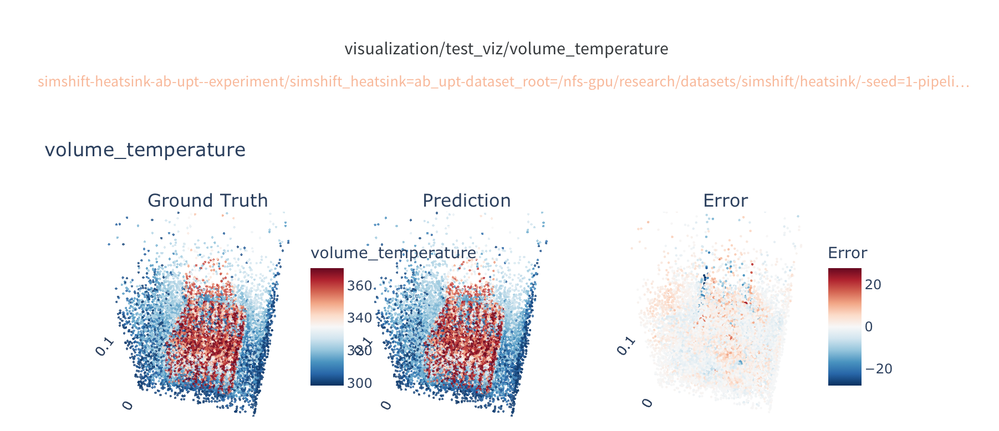

# Heat Transfer Recipe

This recipe trains neural surrogate models for heat transfer simulations on the [SIMSHIFT Heatsink](https://arxiv.org/abs/2506.12007) benchmark dataset.

We published a report on baseline models on [W&B](https://wandb.ai/emmi-ai/heat_transfer/reports/SIMSHIFT-Heatsink-example-with-Noether--VmlldzoxNjUyNjM4Nw)



*Figure: Visualization showing the unnormalized temperature error of a trained ABUPT model.*

## Overview

Given a heatsink geometry described by simulation parameters (number of fins, fin dimensions, inlet temperature, etc.), the model predicts the full 3D volume fields:

- **Velocity** (3 components)
- **Temperature** (scalar)
- **Pressure** (scalar)

The recipe includes:

- **Dataset**: `SimshiftHeatsinkDataset` -- 819 heat transfer simulations with varying fin configurations
- **Models**: AB-UPT and Transformer architectures, both conditioned on simulation parameters
- **Pipeline**: Volume point sampling with configurable anchor subsampling
- **Callbacks**: Denormalized RMSE/nRMSE metrics and interactive 3D plotly visualizations
- **Normalization**: Position scaling to `[0, 1000]`, mean-std normalization for all other fields

## Running an experiment

All commands must be run from the `recipes/heat_transfer/` directory.

### Local training

```bash
uv run noether-train \
  --hp configs/train_simshift_heatsink.yaml \
  +experiment/simshift_heatsink=ab_upt \
  tracker=disabled \
  dataset_root=/path/to/simshift_heatsink
```

### SLURM submission

```bash
uv run noether-train-submit-job \
  --hp configs/train_simshift_heatsink.yaml \
  +experiment/simshift_heatsink=ab_upt \
  dataset_root=/path/to/simshift_heatsink
```

### Available experiments

| Experiment config | Model | Description |
|---|---|---|
| `+experiment/simshift_heatsink=ab_upt` | AB-UPT | Anchored-Branched UPT with 5 physics blocks |
| `+experiment/simshift_heatsink=transformer` | Transformer | Standard Transformer |

## Project structure

```
recipes/heat_transfer/
├── callbacks/          # Evaluation and visualization callbacks
│   ├── heat_transfer_metrics.py          # RMSE and nRMSE in physical space
│   └── heat_transfer_visualization.py    # 3D plotly scatter plots (GT, prediction, error)
├── configs/
│   ├── experiment/simshift_heatsink/     # Per-model experiment overrides
│   ├── model/                            # Model architecture configs
│   ├── slurm/                            # SLURM job configuration
│   ├── tracker/                          # WandB / disabled tracker configs
│   └── train_simshift_heatsink.yaml      # Main training config
├── model/
│   └── heat_transfer_transformer.py       # Transformer wrapper for volume-only + conditioning
├── pipeline/
│   └── heat_transfer_pipeline.py         # Volume point sampling and anchor creation
└── README.md
```

## Configuration

Key parameters in `train_simshift_heatsink.yaml`:

| Parameter | Default | Description |
|---|---|---|
| `dataset_root` | -- | Path to the SIMSHIFT Heatsink dataset (required) |
| `pipeline.num_volume_points` | 4096 | Number of volume points sampled per training sample |
| `trainer.max_epochs` | 75 | Total training epochs |
| `trainer.precision` | float16 | Training precision |
| `optimizer.lr` | 1e-3 | Peak learning rate (cosine decay with 5% warmup) |

## Callbacks

Training automatically logs:

- **Validation loss** every epoch (`OfflineLossCallback`)
- **Denormalized RMSE and nRMSE** per field on val and test sets (`HeatTransferMetricsCallback`)
- **3D scatter visualizations** every 10 epochs on the first test sample (`HeatTransferVisualizationCallback`) -- ground truth, prediction, and per-point relative L2 error
